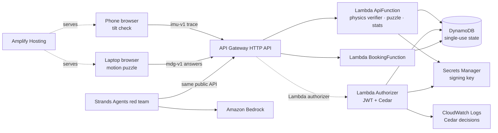
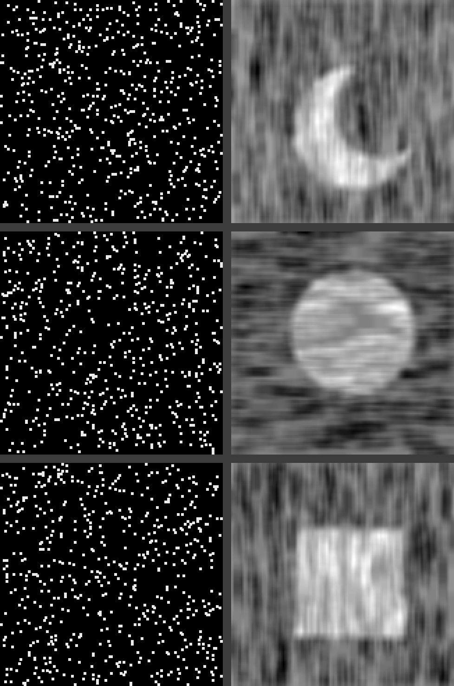

# ARHV: Agent-Resistant Human Verification

> **Agents can read any screen. They can't tilt your phone.**
> ARHV verifies that a person *physically moved a real device, just now, for this request*, and shows exactly
> where the web needs device makers to make that proof unforgeable.

Built for the WeMakeDevs × AWS **First Commit** hackathon (#BharatBuilds). Serverless on AWS: Amplify, API Gateway,
Lambda, DynamoDB, Secrets Manager, Cognito, Amazon Bedrock, with Cedar policies deciding every protected action.

- **Amplify app metadata:** https://main.d1i6xn1rxjcnkk.amplifyapp.com (deployment not verified; CloudFormation deploy is IAM-blocked)
- **Video (≤ 3 min):** _link added at submission_
- **The full argument, protocol and proposal:** [`docs/PHYSICAL.md`](docs/PHYSICAL.md)

## Why human verification has to become physical
1. **Screen-only tests are a race agents win.** Vision models solve 100% of reCAPTCHAv2 image challenges (ETH
   Zürich, 2024); AI agents click "I'm not a robot" (2025); reasoning models reach up to 90% on complex CAPTCHA
   logic puzzles (2026). Every new screen puzzle is only as hard as today's models are weak.
2. **Physical interaction is a different kind of evidence.** An agent can read a screen and drive a browser. It
   cannot tilt the phone in your hand along a path the server picked a second ago.
3. **But browsers can't prove their sensors are real.** Motion APIs are unattested: they can be emulated or
   synthesised. We measure this honestly below.
4. **So device makers must attest physical gestures**, the way Windows 11 made TPM 2.0 mandatory so security
   could rest on hardware. The building blocks already ship (secure enclaves, Private Access Tokens, Play
   Integrity, App Attest, WebAuthn presence), and browsers are already moving from CAPTCHAs to anonymous "human in
   the loop" tokens (Private Access Control Tokens, June 2026). ARHV specifies the missing primitive: an issuance
   signal for such tokens that needs no identity, only a fresh, attested physical gesture.

## What ARHV does
| Tier | Proof | Status | Beats | Doesn't beat (yet) |
|---|---|---|---|---|
| **T1 physical** | **`imu-v1`: tilt your phone to roll a dot through 3 random rings; the server checks the sensor physics** | **built and locally verified; cloud deploy pending** | screen-only agents, emulated/replayed/scripted sensor streams | a physics-aware simulator (the attestation gap) |
| T0 perceptual | `mdg-v1`: a shape visible only in motion; any single frame is noise | built and locally verified; cloud deploy pending | screenshot-driven agents | purpose-built optical-flow solvers |
| T2 vendor-attested | OS-signed physical gesture → private token | proposal ([§7](docs/PHYSICAL.md#7-proposal-vendor-attested-physical-gestures-the-tpm-moment-for-human-verification)) | remote automation and simulators | human farms (quotas handle those) |
Passing either live proof gives a **120-second, single-use token**. A Lambda authorizer asks **Cedar** whether that
token may perform the protected action: booking the last seat at a *fictional* "Rush Hour Counter" (a Tatkal-style rush).

## How the physical check works (`imu-v1`)
The phone streams ~60 samples/s of orientation (β, γ, α), acceleration including gravity and rotation rate. The
server re-derives the challenge from its secret seed and verifies the raw trace; the browser never decides.
| Check | What it rejects |
|---|---|
| **binding**: the trace echoes this challenge id + fresh 128-bit nonce | reuse across challenges |
| **timing**: monotonic, realistic sample rate, no gaps, plausible duration | stitched or fast-forwarded traces |
| **continuity**: ≤ 30° per sample and ≤ 900°/s | teleporting scripted input |
| **gravity**: ‖g‖ ≈ 9.8 m/s² on ≥ 80% of samples | orientation-only emulation (no real accelerometer) |
| **tilt**: the tilt implied by gravity matches reported β/γ (both iOS and Android sign conventions) | streams whose orientation and gravity come from different "worlds" |
| **gyro**: orientation rate correlates with the gyroscope (scale- and sign-free) | dead or random gyroscopes |
| **targets**: each random target reached and held, in order, relative to the user's own baseline | replayed recordings, wrong paths |
Raw sensor traces are never stored; only summary metrics are logged.

## Attacking it (reproducible, offline: `make imu-demo`)
```
orientation-only spoof (DevTools-style)      REJECTED  gravity, tilt, gyro
dead gyroscope                               REJECTED  gyro
gravity from a phone lying on a desk         REJECTED  tilt
teleporting scripted bot                     REJECTED  continuity, gyro
replayed recording (re-bound to new id)      REJECTED  targets
physics-consistent simulator (no phone)      PASSED    -
```
**The last row is the point.** Server-side physics stops every cheap spoof, but a determined attacker can
synthesise a physically consistent stream, because nothing signs the sensor data. That is the gap vendor
attestation closes. (`make imu-demo IMU_API=<api-url>` runs the same attacks against a deployed or local API.)

## The perceptual tier and the red team
`mdg-v1` hides a shape in ~600 moving dots: dots inside drift one way, dots outside the other. People see it
instantly; any single frame, which is all a screenshot-driven agent gets, is statistically uniform noise (tested).
A **Strands Agents** red team on **Amazon Bedrock** (Nova) attacks it through the same public API with a fair,
fully-informed prompt. Results with 95% confidence intervals: [`eval/report.md`](eval/report.md) (generated from
the raw runs in `eval/results/`). The recorded local-API run used Nova 2 Lite with K=4 over 20 valid challenges:
0/20 full puzzles passed and 12/60 rounds were correct (95% CI [0.1183, 0.3178]); no infrastructure-error attempts
were counted.

## Authorization as policy (Cedar)
```
$ make cedar-demo
scenario                               assurance replay today  decision  policy
passed motion challenge                motion    False  0      ALLOW     permit-motion-book
same token replayed                    motion    True   0      DENY      forbid-token-replay
passed phone-tilt challenge (physical) physical  False  0      ALLOW     permit-physical-book
verified account, 0 bookings today     account   False  0      ALLOW     permit-account-book-with-quota
verified account, 1 booking today      account   False  1      ALLOW     permit-account-book-with-quota
verified account, quota used (2)       account   False  2      DENY      (default deny)
unknown assurance                      none      False  0      DENY      (default deny)
```
Policies live in [`backend/functions/authorizer/cedar/`](backend/functions/authorizer/cedar/). When vendor-attested
proofs exist, a site raises the bar per resource by adding one `forbid` policy, not by changing code.

## The proposal: vendor-attested physical gestures
`navigator.physical.request({gesture, challenge})`: the **operating system**, not the page, renders the gesture
in a trusted overlay; the secure sensor hub evaluates real readings; the TPM / Secure Enclave / StrongBox signs
`{origin, nonce, gestureSpecHash, result, time}`; the browser redeems it for a **private, unlinkable token**
(Privacy Pass / Private Access Control Tokens style). Tilt a phone for the proposal; laptop-hinge and fingerprint-presence
proofs are roadmap-only because there is no public lid-angle API and M1/M2 Macs lack the sensor. Design rules learned from Web Environment Integrity's withdrawal: open
standard, no device fingerprinting, always an accessible alternative. Details: [`docs/PHYSICAL.md §7`](docs/PHYSICAL.md).

## Architecture

More diagrams (proof tiers, sequences, the vendor-attested flow): [`docs/ARCHITECTURE.md`](docs/ARCHITECTURE.md).

## Run it
- **Cloud (AWS, us-east-1):** `make setup build deploy web-bootstrap web-env web-deploy`, then `make smoke` (requires the documented IAM permissions).
- **Offline/local:** `make test` (backend + frontend unit tests) · `make cedar-demo` · `make imu-demo` · `make local-up` + `make local-api`.
- Contributors and coding agents start at [`CLAUDE.md`](CLAUDE.md) → [`PLAN.md`](PLAN.md).

## Honest limitations
- Web sensor streams are **unattested**: a physics-aware simulator passes `imu-v1` (shown above). Until vendors
  attest gestures, "physical" means sensor-assisted assurance, not proof of a real device.
- **Human farms** can tilt real phones; quotas, rate limits and cost are the answer there.
- **Accessibility:** people with motor impairments or devices without motion sensors use the motion puzzle or the
  account path (Cognito-verified, quota-limited by Cedar; WCAG 2.2 SC 3.3.8).
- A **purpose-built optical-flow solver** can beat the perceptual puzzle; it protects against general-purpose agents.
- Small-N evaluation over one weekend; every number states its N and conditions.

## Prior art
SenCAPTCHA (IMWUT 2020, a mobile tilt-to-target CAPTCHA) · Apple Private Access Tokens (2022) · Android Play
Integrity and Apple App Attest · WebAuthn user presence · Google Web Environment Integrity (withdrawn 2023) ·
Private Access Control Tokens (Cloudflare, Chrome, Firefox, Edge, Shopify; June 2026). Sources: [`docs/PHYSICAL.md §9`](docs/PHYSICAL.md), [`docs/CONTEXT.md §7`](docs/CONTEXT.md).

## AI tools used
- **Claude Code** (Anthropic): implementation, tests, infrastructure-as-code and debugging.
- **Claude** (claude.ai): research, architecture planning and documentation.
- **Cursor Agent (GPT-5.6 Luna):** implementation, integration, testing, debugging, and evidence-report generation.
- Amazon Bedrock models are part of the product (the red team), not coding tools.

## Credits and licences
React, React Router, Vite, Tailwind CSS (MIT) · AWS Amplify JS + UI (Apache-2.0) · lucide (ISC) · qrcode (MIT) ·
PyJWT, pytest, ruff (MIT) · boto3, moto, cedarpy, Cedar, Strands Agents (Apache-2.0) · NumPy (BSD-3) ·
Pillow (MIT-CMU) · Inter, JetBrains Mono (OFL).

## License
MIT, see [`LICENSE`](LICENSE). ARHV was developed under the codename **PACT**; code identifiers keep that name.


*The perceptual tier: one frame (all a screenshot agent gets) vs. what motion between frames reveals.*
