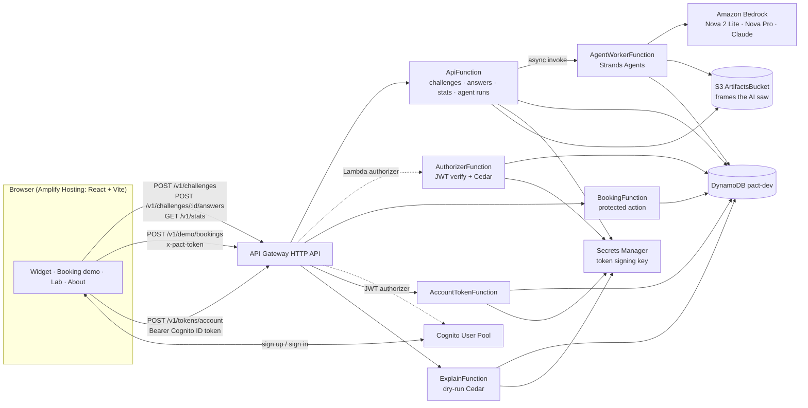

# ARCHITECTURE — PACT

## 1. Overview
A static React app on **Amplify Hosting** talks to one **API Gateway HTTP API**. Anonymous routes (create
challenge, submit answers, stats, agent runs) hit **ApiFunction**. The protected route (`POST /v1/demo/bookings`)
is guarded by a **Lambda authorizer** that verifies the humanity token and asks **Cedar** (via `cedarpy`) for a
decision. The accessible route (`POST /v1/tokens/account`) is guarded by API Gateway's native **JWT authorizer**
against **Cognito**. Red-team runs are queued by ApiFunction and executed asynchronously by **AgentWorkerFunction**
(**Strands Agents → Amazon Bedrock**), which stores the frames the AI saw in **S3**. All state lives in one
**DynamoDB** table; the token-signing key is generated and held by **Secrets Manager**.



## 2. Trust boundaries (why the functions are split this way)
| Boundary | Function | Can | Cannot |
|---|---|---|---|
| Public, anonymous | ApiFunction | create/consume challenges, mint **motion** tokens, read stats, queue agent runs, presign frame URLs | reach Bedrock; perform the protected action |
| Decision point | AuthorizerFunction | verify tokens, mark `jti` used, read quota, evaluate Cedar | perform any action |
| Protected action | BookingFunction | book (fictional), increment account quota | be invoked without an ALLOW from the authorizer |
| Account path | AccountTokenFunction | mint **account** tokens for Cognito-verified users | be invoked without a valid Cognito JWT |
| Read-only explain | ExplainFunction | show the Cedar decision for a token without consuming it | write anything |
| Red team | AgentWorkerFunction | call Bedrock, write frames to S3, record agent stats | mint tokens; be invoked by the API Gateway |

## 3. Flows
### 3.1 Human verification → protected action (motion path)
```mermaid
sequenceDiagram
  participant B as Browser
  participant A as ApiFunction
  participant D as DynamoDB
  participant Z as Authorizer (Cedar)
  participant K as BookingFunction
  B->>A: POST /v1/challenges (x-pact-cohort?)
  A->>A: seed=token_bytes(32); generate_challenge(seed)
  A->>D: put CH#id {answers, seedHex, cohort, expiresAt, status=issued}
  A-->>B: 201 {challengeId, rounds[3]{frames(b64), options[6]}, ...} (no answers)
  Note over B: canvas plays frames ping-pong at 30 fps; user picks 3 shapes
  B->>A: POST /v1/challenges/{id}/answers {answers[3], timingsMs[3]}
  A->>D: conditional update status issued→answered (single use, not expired)
  A->>D: ADD stats counters for cohort
  A-->>B: 200 {passed:true, token, expiresIn:120, assurance:"motion"}
  B->>Z: POST /v1/demo/bookings (x-pact-token)  [API GW invokes authorizer first]
  Z->>Z: verify HS256 JWT (sig, exp, iss, aud)
  Z->>D: put JTI#jti if not exists → replayed?
  Z->>Z: cedarpy.is_authorized(...) → ALLOW via permit-motion-book
  Z-->>K: isAuthorized=true + context{sub, assurance, policies}
  K->>D: put BOOKING#id
  K-->>B: 201 {bookingId, seat, assurance, policy}
```
### 3.2 Accessible path (non-cognitive, WCAG 2.2 SC 3.3.8)
Browser signs up/in with **Cognito** (email code) → `POST /v1/tokens/account` with `Authorization: Bearer <ID token>`
→ API GW JWT authorizer validates issuer/audience → AccountTokenFunction checks `email_verified` → mints a token with
`asr=account` → booking → Cedar `permit-account-book-with-quota` allows while `bookingsToday < 2`.
### 3.3 Red-team run
Browser `POST /v1/agent-runs {model, frames}` → ApiFunction checks alias + daily cap → writes `RUN#id` (queued) →
`lambda.invoke(InvocationType="Event")` → returns 202 `{runId}`. Worker: creates a challenge exactly like a human
gets (cohort `agent:<alias>:k<K>`), renders K consecutive frames per round to PNG (3× scale), uploads them to S3,
asks the Strands agent per round, consumes the challenge, checks answers with the same verifier, records stats,
updates `RUN#id` after each round. Browser polls `GET /v1/agent-runs/{runId}` every 1.5 s and shows the frames via
presigned URLs.

## 4. Naming registry (use these exact names everywhere)
| Kind | Name |
|---|---|
| Stack / region / stage | `pact-dev` / `us-east-1` / `dev` |
| DynamoDB table | `pact-dev` (keys `PK`, `SK`; TTL attribute `ttl`) — local: `pact-local` |
| Secret | `pact/dev/token-signing-key` (template-generated, 64 alphanumerics) |
| Cognito | pool `pact-dev-users`, client `pact-dev-web` (no secret, SRP) |
| Layer | `PactCoreLayer` → Python package `pact_core` |
| Functions (logical IDs) | `ApiFunction`, `AuthorizerFunction`, `ExplainFunction`, `BookingFunction`, `AccountTokenFunction`, `AgentWorkerFunction` |
| HTTP API / authorizers | `PactHttpApi` / `PactTokenAuthorizer` (Lambda, header `x-pact-token`, TTL 0), `CognitoAuthorizer` (JWT) |
| Routes | `GET /v1/health` · `POST /v1/challenges` · `POST /v1/challenges/{challengeId}/answers` · `GET /v1/stats` · `POST /v1/agent-runs` · `GET /v1/agent-runs/{runId}` · `POST /v1/tokens/account` · `POST /v1/demo/bookings` · `POST /v1/authz/explain` |
| Headers | `x-pact-token` (humanity token) · `Authorization: Bearer <Cognito ID token>` · `x-pact-cohort` (analytics label) |
| Challenge family | `mdg-v1` (motion-defined glyph) |
| Token claims | `iss=pact`, `aud=pact-demo`, `sub`, `jti`, `iat`, `nbf`, `exp` (iat+120), `asr` (`motion`\|`account`), `cid` (challenge id, motion only) |
| Assurance levels | `motion`, `account` |
| Cedar | namespace `Pact`; entities `Pact::Visitor{assurance}`, `Pact::Counter{kind}`; action `Pact::Action::"BookTicket"`; resource id `rush-hour-counter`; policy ids `permit-motion-book`, `permit-account-book-with-quota`, `forbid-token-replay` |
| Cohorts | `public` (default) · `study` (known humans via `?cohort=study`) · `agent:<alias>:k<K>` (e.g. `agent:nova-2-lite:k4`) · `local` |
| ID formats | `ch_<24 hex>` challenge · `run_<24 hex>` agent run · `bk_<24 hex>` booking · `v_<16 hex>` anonymous visitor sub |
| S3 keys | `runs/<runId>/r<round>_f<frame>.png` (lifecycle: 7 days) |
| Env vars (cloud) | `STAGE`, `TABLE_NAME`, `TOKEN_SECRET_ARN`, `ARTIFACTS_BUCKET`, `WORKER_FUNCTION_NAME`, `AGENT_MODELS`, `AGENT_RUNS_DAILY_CAP`, `BEDROCK_REGION` |
| Env vars (local only; empty in cloud) | `PACT_DDB_ENDPOINT`, `PACT_TOKEN_SECRET`, `PACT_LOCAL_DEV` |
| Frontend env | `VITE_API_URL`, `VITE_REGION`, `VITE_USER_POOL_ID`, `VITE_USER_POOL_CLIENT_ID`, `VITE_STAGE` |
| Model aliases (default) | `nova-2-lite=us.amazon.nova-2-lite-v1:0`, `nova-pro=us.amazon.nova-pro-v1:0` (+ `claude=<profile id>` if enabled in Phase 0) |
| Log event names | `challenge_created`, `challenge_answered`, `token_minted`, `authz_decision`, `booking_created`, `account_token_minted`, `agent_run_queued`, `agent_round`, `agent_run_done`, `agent_run_error` |

## 5. Repository layout (file level)
```
backend/
  template.yaml                  # SAM (reference: docs/reference/scaffold/backend/template.yaml; cfn-lint clean)
  samconfig.toml                 # stack pact-dev, us-east-1, use_container build, CORS origins
  env.local.json / env.localstack.json   # sam local overrides (dummy secret, local endpoints)
  requirements-dev.txt
  layers/core/requirements.txt   # PyJWT
  layers/core/pact_core/
    __init__.py
    mdg.py        # generator (reference, tested)
    png.py        # stdlib PNG renderer for agent frames (reference, tested)
    tokens.py     # mint/verify HS256 tokens (reference, tested)
    config.py     # env + constants
    keys.py       # token secret: PACT_TOKEN_SECRET (local) or Secrets Manager (cached)
    ids.py        # id generation + validation regexes
    store.py      # all DynamoDB access (single table)
    stats.py      # Wilson intervals, cohort summaries
    http.py       # router, JSON responses, errors, request parsing
    log.py        # structured logging helper
  functions/api/app.py                      # router: health, challenges, answers, stats, agent-runs
  functions/authorizer/app.py               # handler (authorizer) + explain_handler
  functions/authorizer/authz.py             # Cedar decision (reference, tested)
  functions/authorizer/cedar/schema.cedarschema, policies.cedar   # (reference, validated)
  functions/authorizer/requirements.txt     # cedarpy==4.12.0
  functions/booking/app.py
  functions/account_token/app.py
  functions/agent_worker/app.py
  functions/agent_worker/pact_agent/{models,prompts,solver}.py      # (reference, tested with fake model)
  functions/agent_worker/requirements.txt   # strands-agents>=1.56,<2
  tests/conftest.py, test_mdg.py, test_authz.py, test_agent.py (reference) + test_store.py, test_api.py,
        test_authorizer.py, test_booking.py, test_account_token.py, test_worker.py (you write)
frontend/  (see docs/FRONTEND.md)
redteam/__init__.py, bench.py, report.py, flow_solver.py (stretch)
scripts/doctor.sh, stack_output.py, write_frontend_env.py, bootstrap_amplify.py, deploy_frontend.py,
        local_bootstrap.py, cedar_demo.py, gen_shapes_ts.py, make_viz.py, smoke.py (you write)
local/docker-compose.yml
eval/results/*.jsonl, eval/report.md
docs/assets/screenshot-vs-motion.png, shape-icons.png, architecture.png (optional export)
```

## 6. Design decisions (summary; details in the topic docs)
| Decision | Why | Rejected alternatives |
|---|---|---|
| Motion-defined glyph as the one challenge family | Information-theoretic: single frames are uniform noise, so it's not "VLMs are bad at X today" but "the answer isn't in the screenshot" | Drag-to-target (answer path leaks to the client), static illusions (VLMs improving fast), click-order puzzles (scriptable via pixels) |
| Server sends dot coordinates, not video | Tiny, deterministic, canvas-rendered; no media pipeline. Security-equivalent to pixels (a bot can extract dots from pixels trivially) | Server-rendered GIF/MP4 (needs Pillow/ffmpeg in Lambda, bigger payloads) |
| Keyed SHAKE-256 RNG | Published dots can't be used to reconstruct generator state | `random.Random` (MT19937 state recovery) |
| Cedar in-Lambda via cedarpy | Same policy files for Build It (local) and Ship It (cloud); ABAC with forbid-overrides-permit; testable in pytest | Hand-written if/else (not "authorization as policy"); Amazon Verified Permissions (extra setup, second copy of policies) |
| HTTP API + Lambda authorizer with caching off | Single-use tokens must never be cached; cheaper and simpler than REST API | REST API + WAF (WAF can't attach to HTTP APIs anyway) |
| Async red-team worker | Bedrock calls with images take 2–20 s; HTTP API times out at 30 s; polling shows live progress | Synchronous call (timeouts), Step Functions (more moving parts for the same result) |
| One DynamoDB table, on-demand, TTL | Few access patterns, zero ops, scales to zero, pennies | Multiple tables; RDS |
| Functions split by trust boundary; one router function for the public API | Least privilege where it matters; fewer cold starts elsewhere | One Lambda per route (more boilerplate), one Lambda for everything (authorizer + worker privileges mixed) |
| arm64 + `sam build --use-container` | ~20% cheaper; correct manylinux aarch64 wheels (cedarpy, pydantic-core) | x86_64 (documented fallback if builds misbehave) |
| Amplify Hosting manual (zip) deploys via script | Fully scriptable by Claude Code; no GitHub OAuth dance | Git-connected CI (optional later: nicer push-to-deploy story) |
| DynamoDB Local as default local data plane | No account needed; LocalStack now requires an auth token | LocalStack-only |

## 7. Cost model (us-east-1; verify prices on the AWS pricing pages before quoting in the writeup)
| Item | Per unit | Weekend estimate |
|---|---|---|
| Lambda (arm64) | ~0.3 s × 1 GB per challenge | ≪ $0.01 per 1,000 challenges; free-tier eligible |
| API Gateway HTTP API | ~$1 per million requests | ≈ $0 |
| DynamoDB on-demand | ~6 writes + 2 reads per verification | ≈ $0 |
| S3 | frames of agent runs (~12 PNGs × ~5 KB each) | ≈ $0 |
| Secrets Manager | 1 secret, prorated monthly fee + API calls (cached per container) | < $0.05 |
| Cognito | Essentials free tier covers demo MAUs | $0 |
| Amplify Hosting | small static site | ≈ $0 |
| Bedrock (red team) | Nova 2 Lite: a few thousand input tokens per round | cents for hundreds of runs; Claude-class models are the main cost, so keep N small |
**Writeup line:** "A verification costs a fraction of a cent to serve; the whole weekend, including hundreds of
red-team runs, cost $X (Billing console screenshot)." Take the real number from the Billing console in Phase 6.

## 8. Performance budgets
- Challenge generation ≤ 0.5 s at 1 GB Lambda (≈ 0.1 s locally). Payload ≈ 170 KB JSON (3 rounds × 36 frames × ~600 dots).
- Answer + token ≤ 300 ms warm. Authorizer + booking ≤ 400 ms warm.
- Agent run: 3 rounds × (2–15 s) depending on model; worker timeout 180 s.
- Frontend: first render < 2 s on 4G; Amplify UI (auth) is lazy-loaded so the main bundle stays small.
